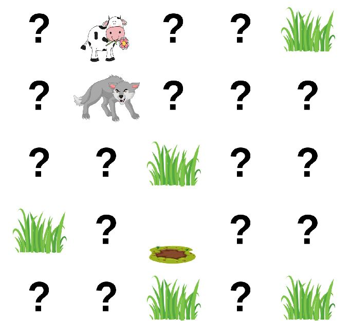

# Knowledge-Based Agent

This project is an implementation of Depth-First Search and Breadth-First Search algorithm on a grid environment. The additional added feature in the program is that the agent have the knowledge of the environment based on its experience.

The image below is the example of the output of the program :

